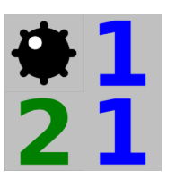
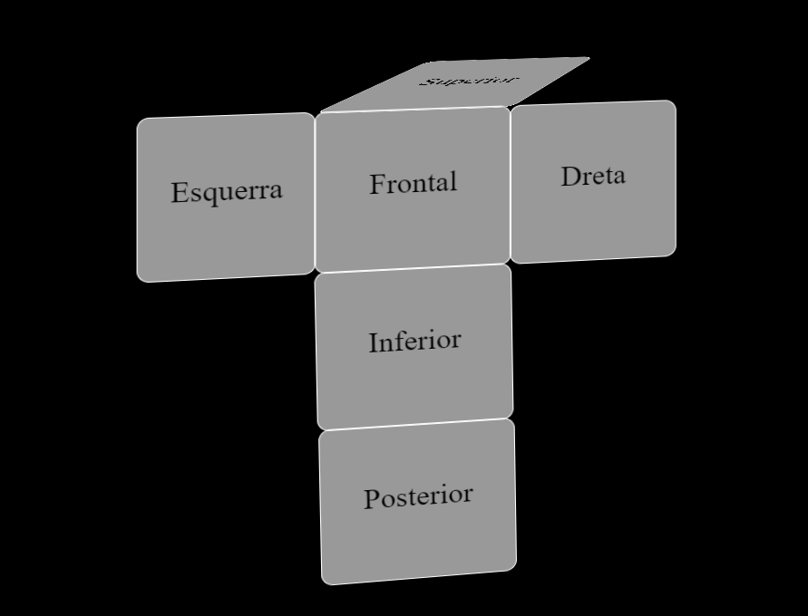
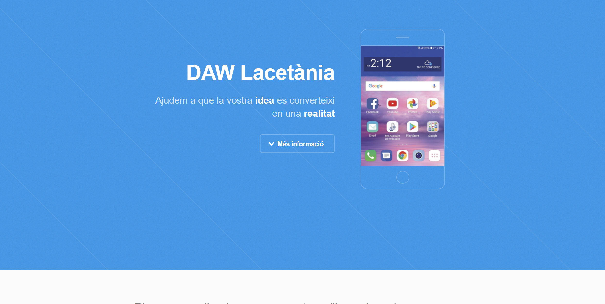
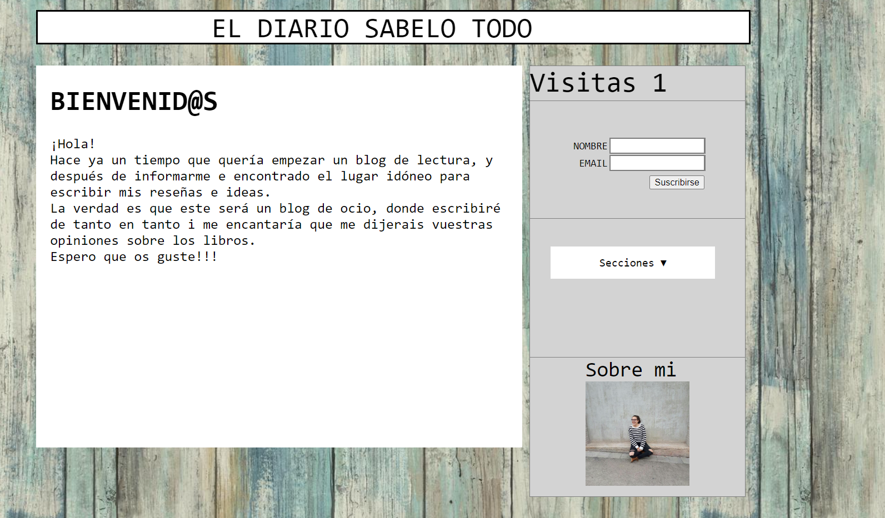
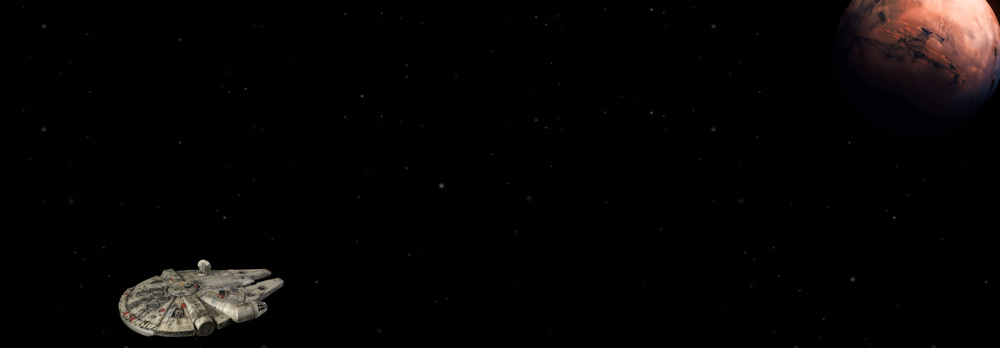

# 🌐 Quick Start - Projects in HTML/CSS

Four simple projects in HTML and CSS: a rotating cube, an introduction to the famous Star Wars movies, and two simple web page layouts.

📅 This project was last updated on **October 20, 2018**.

---

## 🚀 Getting Started

Follow the steps below to get your project up and running:

### 1. **Dowload the documents**

### 2. **Run**
   - Run the files with your current browser
---

## 💻 Built With

- [HTML/CSS](https://www.w3schools.com/html/) - Frontend templating and styling

---

## ✨ Authors

- **Ana Valero Giraldez** - *All work*  
  You can reach me at [GitHub - AnaValero](https://github.com/anavagi/)

---

## 📝 License

This project is licensed under the [MIT License](LICENSE.md) - see the LICENSE.md file for more details.

---

## 📸 Screenshots

---

## ⚡ Features

- 🔒 Simple Minesweeper
- ✍️ Creative Star Wars project
- 🗂️ Rotating cube
- 🖼️ Simple HTML/CSS web

## 📢 Feedback

Feel free to open issues or pull requests for improvements, or contact me for further suggestions!

